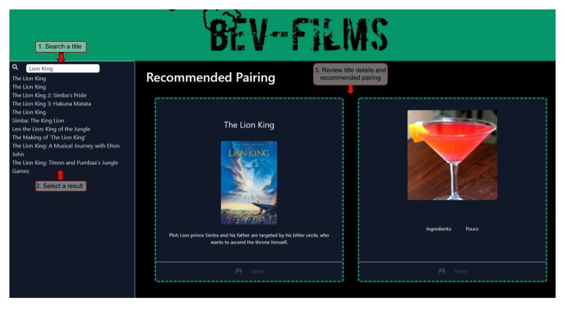

# bev-films

## Summary

This web application delivers recommended drink pairings for movies and tv series.

## How-to: 

<ol>
<li><a href="https://n8blake.github.io/bev-films/">Visit the page</a></li>
<li>Enter a movie or series name in the Search bar, and click the search button or hit Enter to search</li>
<li>Review the returned search results, and select a title</li>
<li>The movie or series details will be displayed, and the drink recommendation will begin processing</li>
<li>The drink recommendation result will be displayed</li>
<li>Optionally, select the link below the movie or drink to visit a corresponding page with more information</li>
</ol>

## Demo

The following image shows the web application's appearance and functionality:

## Elements Used:

<ul>
<li>CSS: <a href="https://tailwindcss.com/">Tailwind</a></li>
<li>Web APIs: <a href="http://www.omdbapi.com/">OMDB</a>, <a href="https://www.thecocktaildb.com/api.php">TheCocktailDB</a></li>
<li>Javascript: <a href="https://jquery.com/">jQuery</a></li>
<li>Recommendation Engine: Leverages <a href="https://www.tensorflow.org/">TensorFlow</a></li>
<li>Local storage used to store returned pairings, eliminating need for re-run of pairing model on subsequent same-title selection (improves performance)</li>
</ul>